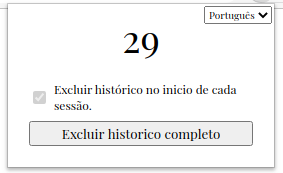

  

  
  <h3 align="center">Clear History Chrome</h3>
  
  

  

    Uma extensão para que deixa seu Google Chrome limpo.
     
    <a href="https://reponame/issues/new?template=bug.md">Algum Problema?</a>
    ·
    <a href="https://reponame/issues/new?template=feature.md&labels=feature">Alguma Sugestão?</a>
  

 Simples e Objetivo. 

 
  

---

Ao se iniciar a sessão o Clear History Chrome exclui completamente o seu histórico; deixando sua navegação mais limpa. 

 

 
  

---

## Copyright and license

[MIT License].

Enjoy :metal:

feito com :heart para o mundo.
